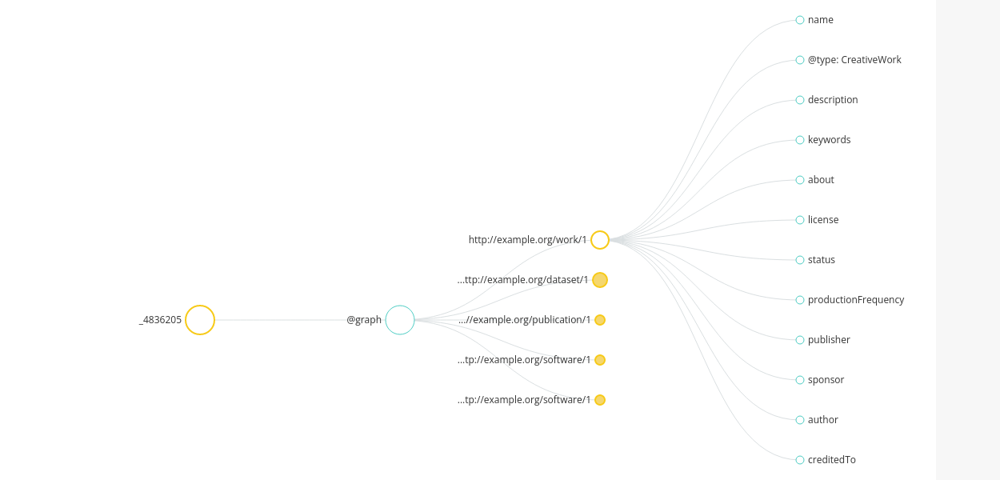

# M@TE Metadata Model 

## Summary

In this document the term `m@tedata` is used to refer to the metadata model and implemetation used in the M@TE project. 
The idea of a computational model is encapsulated through a collection of several `schema.org` types or entities. Together form a meaningful unit for the purposes of communication, citation, distribution, preservation, etc. 

The development was informed by projects such as codemeta, ro-crate, comses.net, bioschemas, science-on-schema.
https://github.com/ModelAtlasofTheEarth/mate_template/tree/main

## Structure and development

The metadata template (metadata_V*.json) represents WIP to define/refine m@tedata. 

A key requirement is that m@tedata can fulfil metadata requirements (ISO 19115) used in the NCI GeoNetwork catalog. 

The most general layer of information is collected in a`CreativeWork`. Many of the field requierements in ISO 19115 are easily mapped to  `CreativeWork` Properties. For instance `CreativeWork` properties will hold information about licence authors, keywords, version, citation, funder etc.

We use the`CreativeWork` `hasPart` as a flexible container to describe different entities. Again, these entities are based largely on Schema.org entities: e.g. `DataSet`, `SoftwareSourceCode`. However, the metadata format is flexilble, and additional entities may be added by the user, and relationships may also be changed.  

Some of these entities refer to directories and file payloads that are stored in the M@TE model (e.g. on NCI), other entities exist elswhere are are identified with @id.

The design here is somewhat similar to RO-Crates, which use a json-ld @graph array to add differtent entities to the metadata model.

## Ambiguities and definitions

In many cases computatation models involve a novel usage (new model) developed with an existing software framework/application. This may involve a new set of paramaters, new plugins, modification to the source code of the existing software application. 

We want the metadata model try to reflect these relationships. We encourage users to add any model code (and inputs) that are required to run their model. Physcall, these files go into the `model_code_inputs` dircectory.  In the metadata model this directory is represented with the dual types ["SoftwareSourceCode", "Dataset"] type. Other types can be added and extended. 
For intance, the "ComputationalWorkflow" is extension of "SoftwareSourceCode" from Bioschemas (https://bioschemas.org/), which introduces Properties such as "input" and "output".   

We use the "TargetProduct" property of the "SoftwareSourceCode" to designate the software framework/application that the code is designed to run on. The TargetProduct is given the (dual) @type ["SoftwareSourceCode", "SoftwareApplication"]. This reflects the fact that the TargetProduct is a often a binary or a pakaage within an environemt (Julia, Pythom) but is often distributred as source code, and builty by users/ 

There has been some debate about the intented use of "TargetProduct",  and whether it should reflect a SoftwareApplication or the RuntimeEnvironment, or teh OS. We interpret is as the former (see https://github.com/codemeta/codemeta/pull/300)

## Questions:

* What to do with multiple entites of the same type (multiple publications, datasets)?
* What @id takes precedence?
* Should we use the concept of a root directory as in RO-Crates

## Comparison with RO-Crate

The m@te-data model has several similarities to ro-crate (we try to adopt the same terminology). One similarity is the use of the @graph array as the "bucket" that stores different entitites. Like RO-Crates, m@te-data can also reference  both internal entites, such as code stored in the `code` subdirectory ("@type": "SoftwareSourceCode"), as well as external entities which are stored or accessed separately, via absolute URIs. 

Unlike RO-Crates, m@te-data is not intended to create file manifests. One reason for this is that M@TE model a anticapted to have a more homegneous subdirectory structure. That is, we know in advance that certain subdirectories will contain certian files. File manifests are provided by M@TE, but are not included in the m@te-data model. Nor do we envisage m@tadata as a way to encapsulate workflow information (e.g, https://www.researchobject.org/ro-crate/1.1/workflows.html). In this respect we follow comses.net, and leave this to the user to document in standard ways. 

## Structure and creation of a M@TE model

A M@TE model is usually created using a github issue form. When you fill out and submit a `model_submission` issue, some checks will run, and a new repository will be created. This top level directory will be named with a slug: e.g `name_topic_year`. The m@te-data.json file will sit in this directory. The model submission workflow promarily helps users contruct this "bucket" of metadata.  

The URI for the model will generally be provided through a doi provided by NCI, within the M@TE collection. 

Not all entities need to be physically stored in the M@TE model. For instance, if the code for your model is already archived (e.g. FigShare, Zenodo), you may wish to simply add a URI to this entitity in the graph. Alternatively, you can used the `code` subdirectory to add your model code; in other words, you can add payload files to model subdiretories. In this case the URI (@id) will be doi provided by NCI. This is simalar to the model used in ro-crate. 

While code and documentation can be provide through github, model output data will usually be handled separetely. If you click the box "I plan to submit model data", a hidden diretcly will be created in the model creation phase. Later, once the model hae been checked and copied onto the NCI fielsystem, you will recieve an upload link. 

At this stage, you will relise that your model exists both as a github repository, as well as beign hosted on the NCI. Morover, your model may contain dofferent payloads at different locations depending on different locations. The metdata file is what links these entities together. 

## m@tedata template

 
